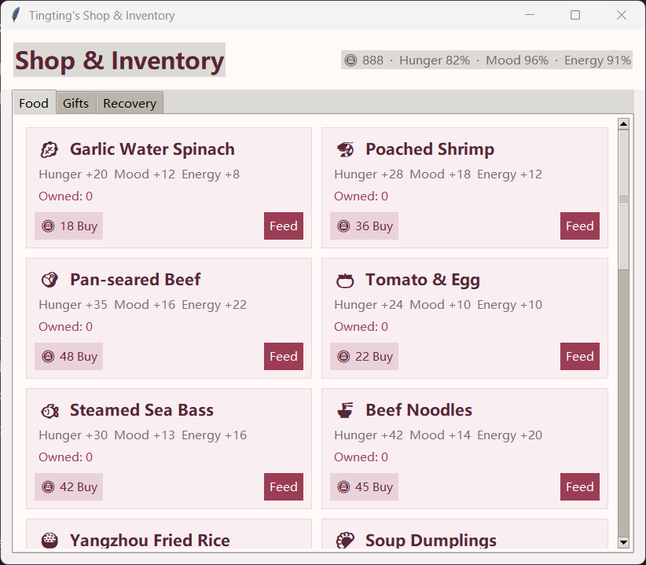
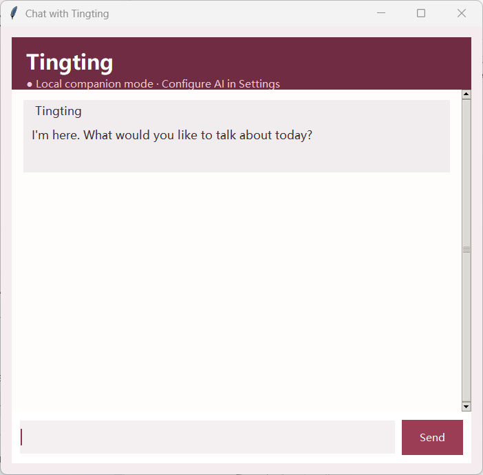

# Tingting Heartbeat / 心动婷婷

<p align="center">
  
</p>

<p align="center">
  A warm, interactive Windows desktop companion with touch reactions, activities, feeding, gifts, achievements, statistics, and optional AI chat.
</p>

<p align="center">
  <a href="README.zh-CN.md">简体中文</a> ·
  <a href="#download">Download</a> ·
  <a href="#license">License</a>
</p>

Download: https://pan.baidu.com/s/1EKhXNDwNXucy-r-BCxfDWw KEY: 6688 

## Highlights

- Transparent, always-on-top desktop character that can be dragged around the screen.
- Different reactions for touching the hair, face, chest, arms, and dress, with varied dialogue and facial expressions.
- More than 30 character actions, including reaching out when her arm is clicked and spinning when her dress is clicked.
- Natural idle sleep after five minutes without interaction.
- One-click Do Not Disturb in the right-click feature center pauses proactive bubbles, low-status nudges, and random actions.
- The Shop includes an Outfits tab where players can preview, permanently buy, and switch dresses with coins; food, gifts, and recovery items also track lifetime purchase counts.
- The pale blue floral dress includes complete high-resolution animation rows, and both dresses support eight separately drawn high-resolution interaction poses.
- Feeding system with 20 dishes, including water spinach, poached shrimp, and beef.
- Gifts, recovery items, coins, offline rewards, inventory, mood, hunger, and energy.
- 50 local achievements, including long-term companionship, streak, and advanced interaction goals, with claimable coin rewards.
- Companion-time, idle-time, touch, chat, feeding, gift, coin, and preference statistics.
- Locally saved AI conversations with new-chat, history, selectable copy, elapsed waiting status, and single-request sending.
- Optional OpenAI-compatible AI chat and Responses API web search configured from the settings screen.
- Simplified Chinese and English interfaces.
- Adjustable character size and a smooth pink-and-gold click-light effect.
- Installer upgrades preserve local game data.

## Preview

<p align="center">
  
  <br>
  <sub>Real in-app frames: character actions and the pink-and-gold click-light effect.</sub>
</p>

<p align="center">
  
  <br>
  <sub>Shop, inventory, food, gifts, and recovery items.</sub>
</p>

<p align="center">
  
  <br>
  <sub>Local companion chat with optional OpenAI-compatible AI configuration.</sub>
</p>

## Download

Download the latest Windows installer or portable executable from the repository's **Releases** page.

The installer supports in-place upgrades. Save data is stored separately in:

```text
%APPDATA%\TingtingDesktopPet
```

The app checks GitHub Releases at startup and can download a newer installer after confirmation. Automatic checks can be disabled, and updates can also be checked manually from Settings.

Installing a newer version or using the standard uninstaller does not delete this folder.

## Controls

- Drag with the left mouse button: move Tingting.
- At a display edge, up to half of Tingting can be tucked off-screen without jumping to the opposite side.
- Click different body areas: trigger area-specific reactions.
- Double-click: open chat.
- Right-click: open the feature center.
- Hide or close the character: restore it from the system tray.

## AI chat

Open **Settings** and enter an API base URL, model name, and API key. The application accepts OpenAI-compatible endpoints and can optionally enable Responses API web search when supported by the model and endpoint.

Conversations are saved locally. Use the top-right controls to create a new conversation or switch history. Chat text is selectable and copyable; while a reply is running, the window shows elapsed waiting time and locks the composer to prevent duplicate requests.

The API key is never bundled into shared builds. On Windows it is stored locally using DPAPI encryption tied to the current user account. Without an API key, the chat window still offers a small set of offline responses.

## License

The source code is licensed under the [MIT License](LICENSE).

The Tingting character likeness, sprite sheet, portraits, icons, and other character artwork are **not** covered by the MIT License. They are provided under the separate [Character Assets License](ASSETS_LICENSE.md), which permits personal, non-commercial use with this project but prohibits unauthorized commercial use or standalone redistribution.

Source code and character artwork are licensed separately. Please review both license files before using or redistributing this project.
