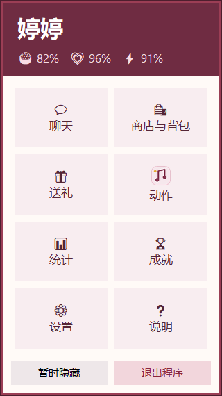
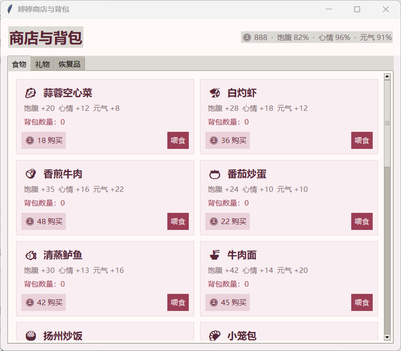
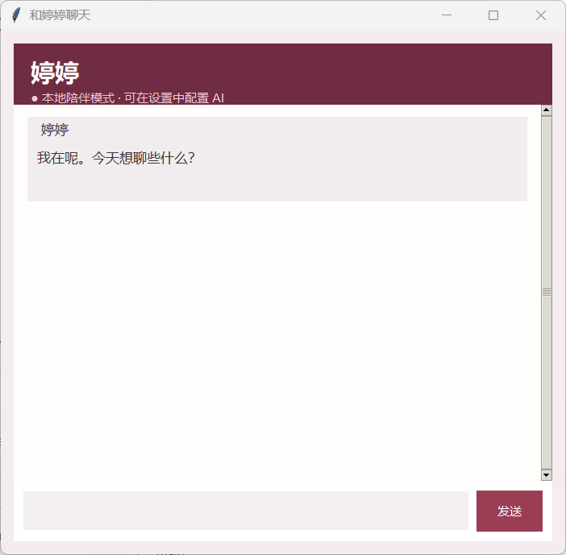

# 心动婷婷 / Tingting Heartbeat

<p align="center">
  
</p>

<p align="center">
  一款温暖、可互动的 Windows 桌面陪伴小游戏，支持触摸反馈、动作、喂食、送礼、成就、统计和可选 AI 对话。
</p>

<p align="center">
  <a href="README.md">English</a> ·
  <a href="#下载安装">下载安装</a> ·
  <a href="#开源协议">开源协议</a>
</p>

下载链接: https://pan.baidu.com/s/1EKhXNDwNXucy-r-BCxfDWw 提取码: 6688

## 主要功能

- 透明置顶桌面人物，可在桌面自由拖动。
- 触摸头发、脸、胸部、手臂和裙子会触发不同台词、动作及表情。
- 40 多种人物动作，新增击掌、比心、屈膝礼、鼓掌、剪刀手、展示裙摆和伸懒腰等真实绘制姿势。
- 超过五分钟没有互动后，婷婷会自然进入桌前睡眠状态。
- 右键功能中心支持一键免打扰，可暂停主动气泡、低状态催促和随机动作。
- 商店新增“服装”分页，可预览、购买和切换服装；浅蓝印花长裙包含完整高清动画，两套服装均适配 8 个高清互动姿势。食物、礼物和恢复品会分别记录历史购买数量。
- 20 道菜品，包含蒜蓉空心菜、白灼虾和香煎牛肉。
- 礼物、恢复品、金币、挂机及离线收益、背包、心情、饱腹和元气系统。
- 50 项本地成就，包含长期陪伴、连续登录和高难度互动目标，达成后可以领取金币奖励。
- 记录陪伴、挂机、触摸、聊天、喂食、送礼、金币及互动偏好。
- AI 对话会保存在本机，支持新建对话、历史记录、文字复制、运行计时和单任务发送。
- 可在设置中配置 OpenAI 兼容接口，并选择启用 Responses API 联网搜索。
- 默认简体中文，可切换英文。
- 支持实时调整人物大小，并提供流畅的粉金点击光效。
- 使用安装版覆盖升级时会保留原有游戏数据。

## 实际演示

<p align="center">
  
  <br>
  <sub>程序内实际人物帧：动作演示与粉金点击光效。</sub>
</p>

<table>
  <tr>
    <td align="center" width="34%">
      
      <br><sub>右键功能中心</sub>
    </td>
    <td align="center" width="66%">
      
      <br><sub>商店、背包、食物、礼物与恢复品</sub>
    </td>
  </tr>
</table>

<p align="center">
  
  <br>
  <sub>支持本地陪伴回复，也可以配置 OpenAI 兼容接口。</sub>
</p>

## 下载安装

请前往本仓库的 **Releases** 页面下载最新 Windows 安装版或便携版。

安装包支持直接覆盖升级。游戏数据独立保存在：

```text
%APPDATA%\TingtingDesktopPet
```

程序会在启动后自动检查 GitHub Releases；发现新版时可直接下载安装包。也可以在“设置”中关闭自动检查或手动点击“检查更新”。

安装新版或使用标准卸载程序都不会删除这个目录。

## 操作方式

- 按住鼠标左键拖动：移动婷婷。
- 拖到显示器边缘时，最多可将人物的一半藏到屏幕外，不会跳到另一侧。
- 点击人物不同部位：触发专属反应。
- 双击人物：打开聊天。
- 右键人物：打开功能中心。
- 隐藏或关闭人物后：通过系统托盘重新显示。

## AI 对话

在“设置”中填写 API 地址、模型名称和 API Key。程序支持 OpenAI 兼容接口；模型及接口支持时，还可以选择启用 Responses API 联网搜索。

聊天记录会自动保存在本机，可通过右上角按钮新建对话或切换历史记录。聊天文字支持选择和复制，发送期间会显示等待秒数，并暂时锁定输入区以避免重复发送。

API Key 不会被打包进分享文件，在 Windows 中会通过当前用户的 DPAPI 加密后保存到本机。未配置 API Key 时，聊天窗口仍提供少量本地陪伴回复。

## 开源协议

程序源代码采用 [MIT License](LICENSE)。

婷婷的人物肖像、精灵图、头像、图标及其他角色美术素材不属于 MIT 授权范围，单独适用[人物素材授权说明](ASSETS_LICENSE.md)：允许结合本项目进行个人、非商业使用，但不允许未经授权的商业使用或将人物素材单独转载、出售。

源代码与人物美术素材分别适用不同授权；使用或再分发本项目之前，请同时阅读两份授权文件。
